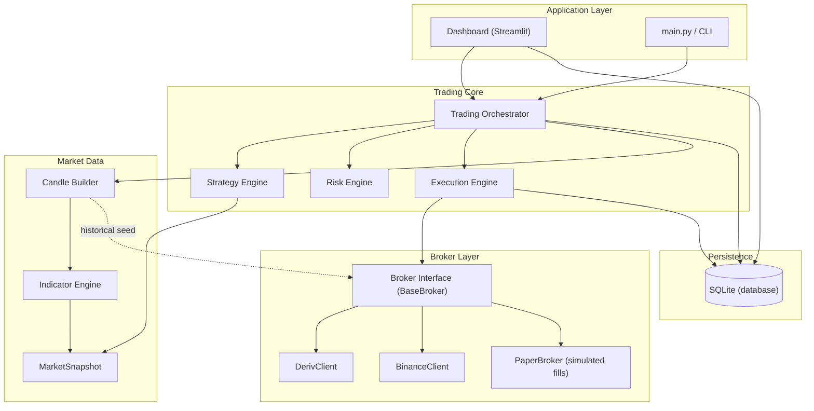
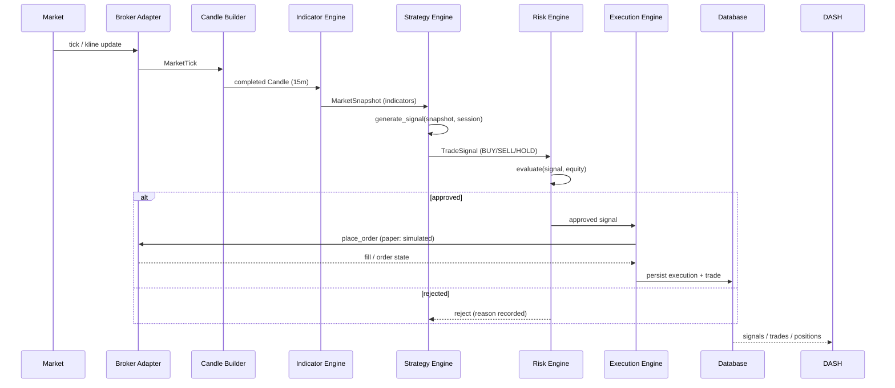
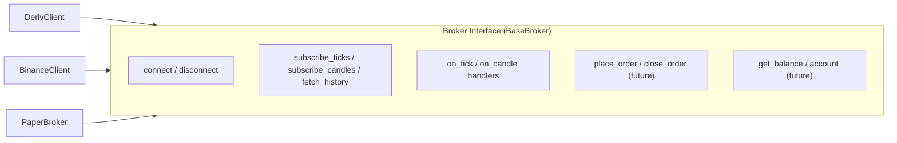
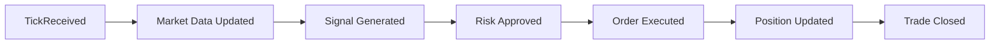
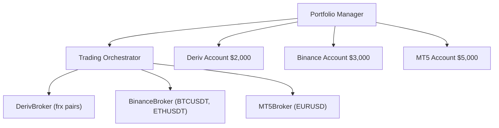

# 01 — System Architecture

## Layered Architecture

**Current state:** Deriv and Binance clients already implement the same
informal interface and are swapped via the orchestrator's `broker_cls` /
`broker_type` selection. The `BaseBroker` ABC (formal contract) is the next
code step.

## Runtime Flow

## Broker Abstraction

The trading engine never imports a broker-specific class for logic. It depends
on the `BaseBroker` contract:

Both adapters today:

| Capability | DerivClient | BinanceClient |
|------------|-------------|---------------|
| connect / disconnect | ✅ | ✅ |
| subscribe_ticks | ✅ (needs token for stream) | ✅ (token-free) |
| subscribe_candles | ✅ (needs token for stream) | ✅ (REST backfill + kline stream) |
| fetch_history (one-shot) | ✅ | ✅ |
| on_tick / on_candle / on_error | ✅ | ✅ |
| reconnect / resubscribe | ✅ | ✅ (debounced) |
| order placement | ✅ (contract model) | stubbed (paper data broker) |
| auth | token optional (paper) | none (public) |

**Key rule:** any engine-layer code that touches data uses
`MarketTick`/`Candle` (internal models). Adapters own the translation.

## Event Flow (target)

Consumers (alerts, analytics, dashboard, monitoring) subscribe to these events
without the producers knowing about them. The event bus is an optional
enhancement; the current pipeline is direct method calls, which is fine at this
scale — the flow must be preserved so the bus can be layered on later.

## Multi-Broker (target)

Each broker keeps its own connection, market data, orders and positions. The
orchestrator coordinates them; the **Portfolio Manager** (new layer) allocates
capital, aggregates account value, enforces global exposure limits and produces
consolidated reports.

## Portfolio Layer (future, Phase 09)

Responsibilities:

- Capital allocation between brokers.
- Total account value / equity aggregation.
- Global risk limits (max daily loss, drawdown, exposure) across accounts.
- Correlation guard — avoid overexposure to the same underlying across brokers.
- Consolidated performance reporting.

Until multi-broker is active, the `RiskManager` enforces per-account limits and
the portfolio layer is a thin wrapper.
