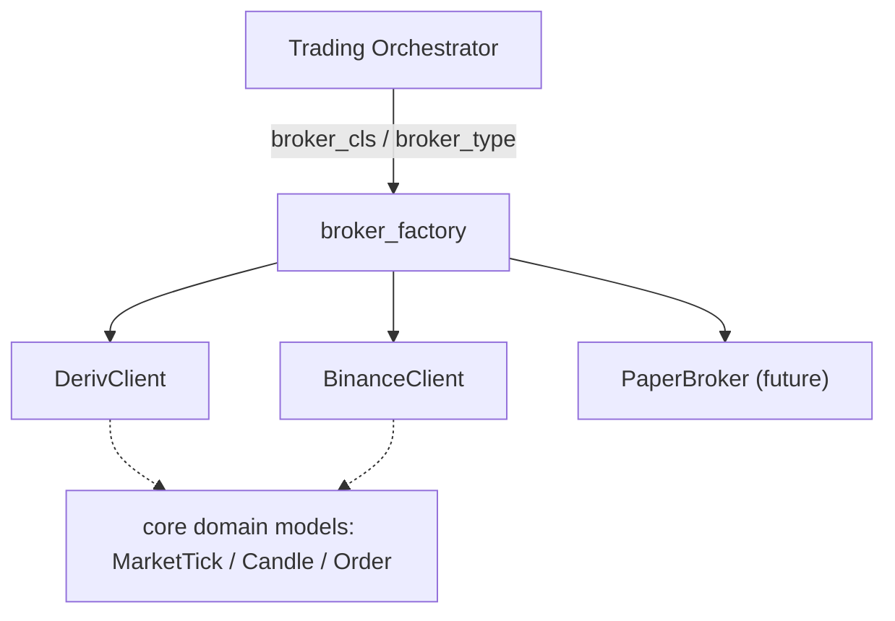
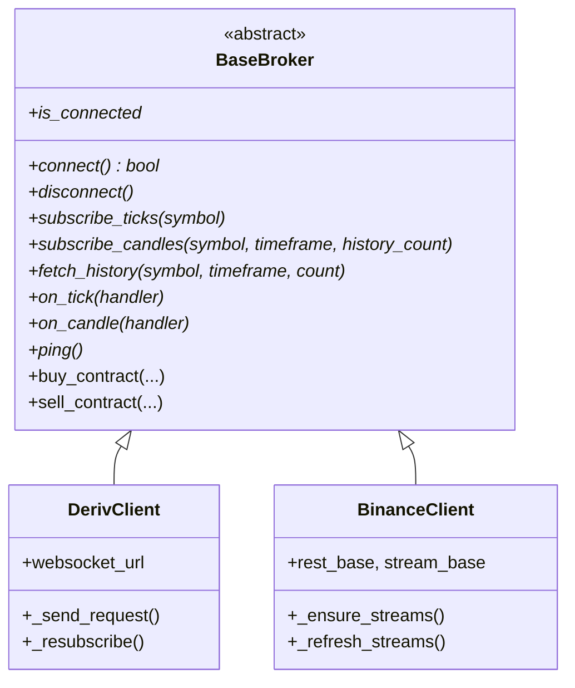
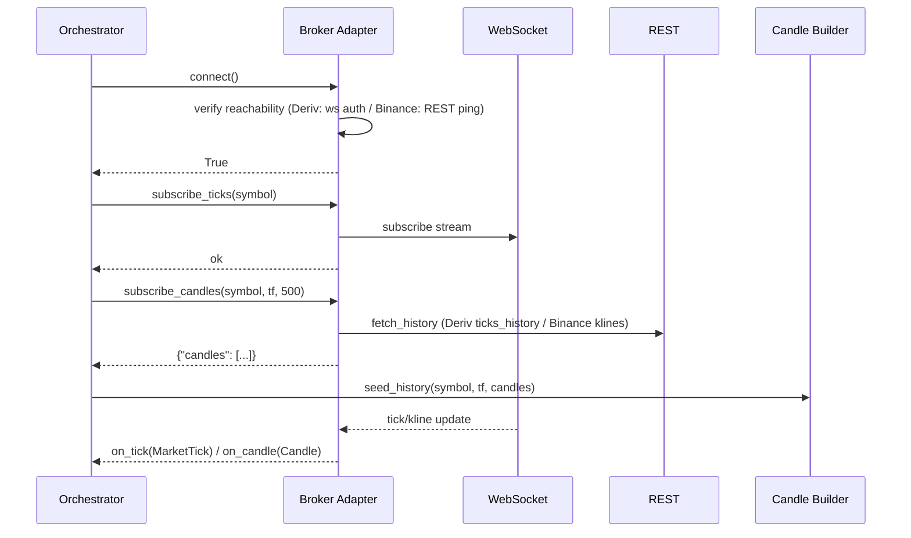

# Phase 2 — Broker Framework

## Objective

Provide a **broker-agnostic market-data + order interface** so the trading
engine never depends on a specific broker. Deliverable: `BaseBroker` contract,
adapters for Deriv and Binance (token-free market data for paper mode), and a
factory for selection.

## Architecture



The engine imports only the interface + models; it never imports a broker
adapter for logic.

## Responsibilities

- `BaseBroker` (ABC): define connect/disconnect, subscribe ticks/candles,
  one-shot history, handler registration, ping, and (live-only) order methods.
- Each adapter: own all broker protocol details (Deriv WS JSON RPC, Binance
  combined-stream WS + REST), translate to/from core domain models.
- Factory: map `broker_type` ("deriv" | "binance") → adapter class.
- Selection: CLI `--broker`, env `BROKER`, or `broker_type` in settings.

## Folder Structure

```
src/broker/
├── base_broker.py      # NEW: BaseBroker ABC
├── deriv_client.py     # DerivClient (subclass BaseBroker)
├── binance_client.py   # BinanceClient (subclass BaseBroker)
├── broker_factory.py   # NEW: get_broker_class(broker_type)
└── __init__.py
```

## Class Diagram



## Sequence Diagram (subscribe + history seed)



## Data Flow

- In: raw broker messages (ticks, klines, history responses).
- Transform: adapter normalizes timestamps (ms/s), prices, volume, symbol case.
- Out: `MarketTick` / `Candle` → handlers; `{"candles":[...]}` for seeding.

## Configuration

| Setting | Default | Purpose |
|---------|---------|---------|
| `BROKER` / `--broker` / `BrokerConfig.broker_type` | `deriv` | Adapter selection |
| `DERIV_APP_ID`, `DERIV_API_TOKEN` | — | Deriv auth (live / token-gated streaming) |
| `reconnect_attempts`, `reconnect_delay_base/max` | 10 / 1.0 / 60.0 | Backoff bounds |
| `heartbeat_interval` | 30s | Keep-alive |

## Implementation Steps

1. Add `BaseBroker` ABC in `src/broker/base_broker.py`.
2. `DerivClient(BaseBroker)` and `BinanceClient(BaseBroker)` — no behavior change.
3. Add `src/broker/broker_factory.py` mapping broker_type → class.
4. Keep orchestrator selection (`broker_cls`/`broker_type`) — it already works.
5. (Next phase) Move `Tick`/`Candle` → core domain models; adapters keep aliases.

## Testing

- Protocol tests per adapter (fake WebSocket): routing, subscription tracking,
  history normalization. ✅ 23 (Deriv) + 14 (Binance).
- Broker selection wiring: orchestrator picks the right class + default symbols. ✅
- Live smoke: connect → subscribe → history seed → ticks flow → clean disconnect. ✅

## Definition of Done

- [x] Both adapters expose the identical public interface.
- [x] Selecting a broker is a one-line config change (`--broker binance`).
- [x] Full paper pipeline runs on Binance with 0 errors (validated live).
- [x] 164-test suite green.
- [x] `BaseBroker` ABC exists (`src/broker/base_broker.py`); both clients subclass it.
- [x] `MarketTick`/`Candle` moved to broker-neutral `src/core/domain.py` (back-compat `Tick` alias kept).
- [x] `broker_factory.py` maps `broker_type` → adapter; orchestrator uses it.
- [x] `Signal`/`Trade`/`Position`/`Account` migrated to `src/core/domain.py` with back-compat aliases (`TradeSignal`, `TradeExecution`); `Order` is the remaining broker-native concept.

## Future Improvements

- `PaperBroker` as a first-class adapter (order flow abstraction).
- MT5 broker adapter.
- Broker factory with runtime validation + config-driven broker list.
- `get_balance()` returning `Account` model.
