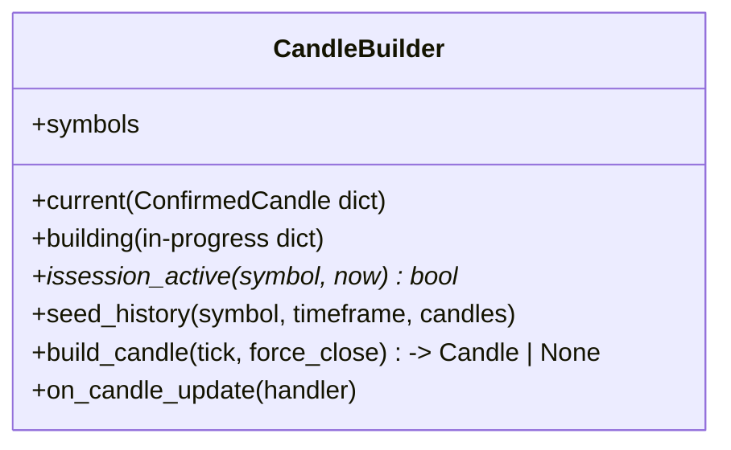
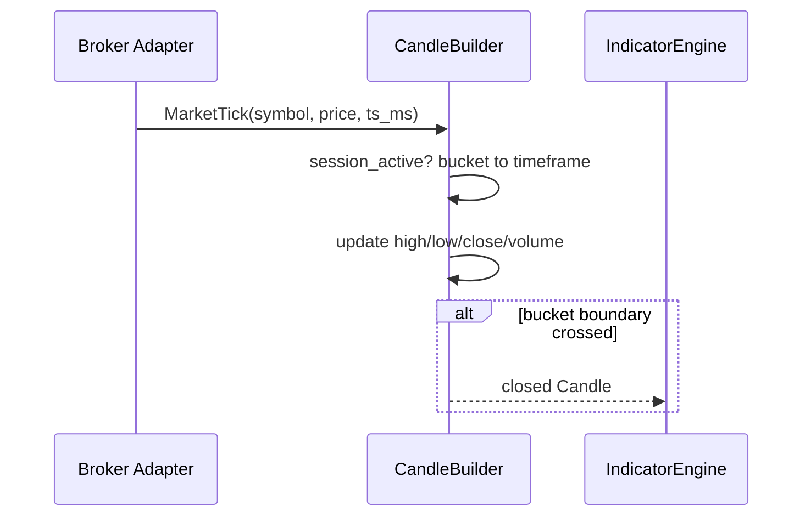

# Phase 03 — Market Data

## Objective

Turn raw broker ticks and candle history into **normalized, time-boxed market
data** the trading core can consume: `MarketTick` → completed `Candle` → cached
symbol/timeframe state. Delivers the `CandleBuilder` layer and the session/weekend
gate so strategies only ever see clean candles.

## Architecture

See `01_System_Architecture.md` (DATA block). Broker adapters (Phase 02) emit
`MarketTick`/`Candle`; the candle builder aggregates ticks into closed candles
and maintains per-symbol state that indicators read.

```
broker adapter ──MarketTick──> CandleBuilder ──Candle(closed)──> Indicator Engine
              └──fetch_history──▶ {"candles":[...]} ──seed──▶ buffers
```

## Responsibilities

- Aggregate `MarketTick` (price + ms timestamp) into the current forming candle.
- Close a candle when epoch advances past its window (per-timeframe bucketing).
- Enforce the **session gate** (`issession_active`): forex closes weekends
  (Sat 00:00 → Sun 22:00 UTC); crypto runs 24/7.
- Seed one-shot history (`subscribe_candles` / `fetch_history`) from the broker.
- Track per-symbol defaults and the active symbol.

It must **not** compute indicators, decide trades, or know broker message formats.

## Folder Structure

```
src/data_engine/
└── candle_builder.py      # CandleBuilder: ticks → OHLC, session/weekend gate
```

## Class Diagram



## Sequence Diagram (tick to closed candle)



## Data Flow

- In: `MarketTick`, `{"candles":[...]}` history, broker `epoch` (ms or s).
- Transform: normalize timestamp to epoch seconds; range to OHLCV.
- Out: closed `Candle` (→ indicators) + persisted candle rows (Phase 10).

## Configuration

| Setting | Default | Purpose |
|---------|---------|---------|
| `default_timeframe` | `15m` | Bars built unless overridden |
| `forex_weekend_closed` | `true` | Fri close → Sun open gate |
| `symbols` | per-broker | Instruments to subscribe |

## Implementation Steps

1. Bucket ticks into per-symbol-per-timeframe windows.
2. Emit a fully-formed candle only when the window is complete.
3. Add `register` weekend/session gate (deterministic clock for tests).
4. Seed history from the broker on connect.

## Testing

- Unit: tick→OHLC aggregation, roll edges, candle replacement, session gate
  (deterministic clock). ✅ in `tests/`.
- Integration: history seed → closed candles have contiguous epochs.

## Definition of Done

- [x] CandleBuilder emits closed candles with correct OHLCV.
- [x] Forex weekend gate + crypto bypass (see BLUEPRINT_CHECKLIST rows 6–7).
- [x] Suite green.

## Future Improvements

- Ticker buffer + symbol manager (target `market_data/tick_buffer`).
- Configurable aggregations (heikin-ashi, Wicks) for strategy inputs.