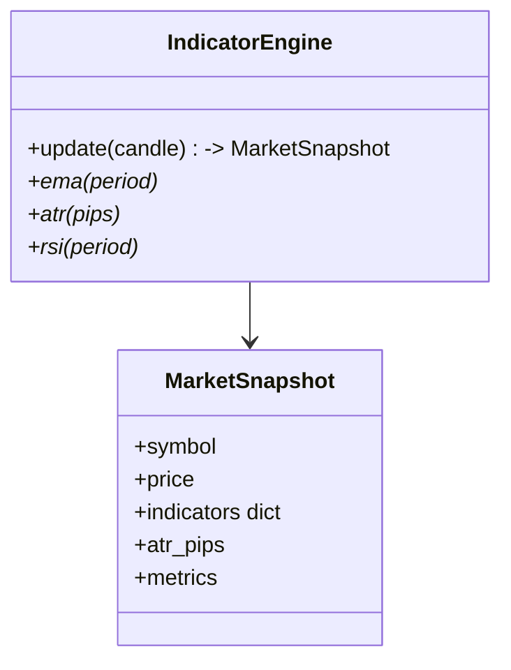

# Phase 04 — Indicators

## Objective

Convert closed candles into a **`MarketSnapshot`** carrying the technical inputs
strategies and risk read. Delivers the `IndicatorEngine` (EMA, ATR, RSI, pip
math) as a pure, broker-neutral layer.

## Architecture

See `01_System_Architecture.md` (IND block). Candles in → snapshot out; nothing
below this layer depends on broker or strategy specifics.

## Responsibilities

- Maintain rolling windows per symbol.
- Compute indicators on closed candles: EMA(12/26), ATR(14) in pips, RSI(14),
  pip size via `get_pip_size`.
- Expose `MarketSnapshot` (price, indicators, volatility) to strategically.
- Remain deterministic for backtests (no look-ahead window).

Must **not** produce signals or apply risk rules.

## Folder Structure

```
src/indicators/
└── technical.py      # IndicatorEngine + MarketSnapshot
src/utils/pips.py     # crypto-aware pip sizing (ETH → $1/pip etc.)
```

## Class Diagram



## Data Flow

- In: closed `Candle` + pip size.
- Transform: rolling indicator math.
- Out: `MarketSnapshot` consumed by `StrategyEngine`; stored for analytics.

## Configuration

| Setting | Default | Purpose |
|---------|---------|---------|
| `ema_short` / `ema_long` | 12 / 26 | Crossover inputs |
| `atr_period` | 14 | Volatility / stop sizing |
| `rsi_period` | 14 | Momentum filter |
| pip model (`get_pip_size`) | per-symbol | BTC/ETH $1/pip, forex .0001 |

## Implementation Steps

1. Rolling windows + EMA/ATR/RSI.
2. Hook updates into the candle callback.
3. State cleanup on missing candles (no look-ahead in backtest).

## Testing

- Deterministic indicator values on fixtures.
- ATR div-by-zero guard (empty window). ✅ suite.
- Crypto pip sizing vs forex.

## Definition of Done

- [x] `MarketSnapshot` produced each closed candle.
- [x] Indicators used by the EMACrossover strategy.
- [x] Backtest and live use the same indicator code path.

## Future Improvements

- More indicator families (MACD, Bollinger, VWAP).
- Regime classification outputs for the AI lab.