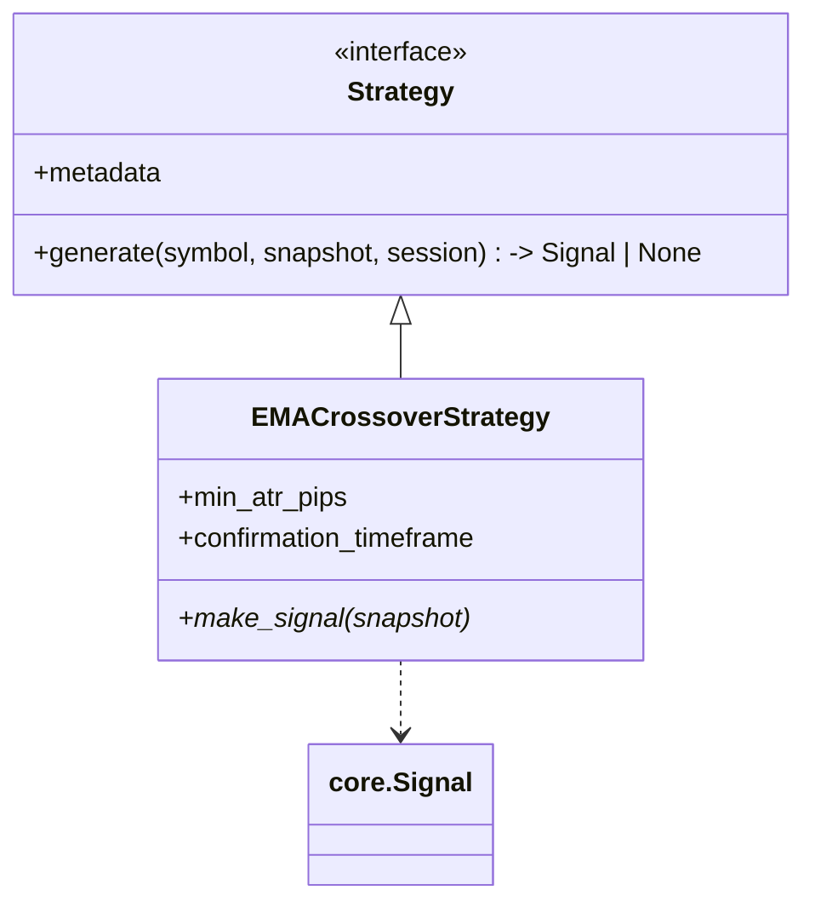
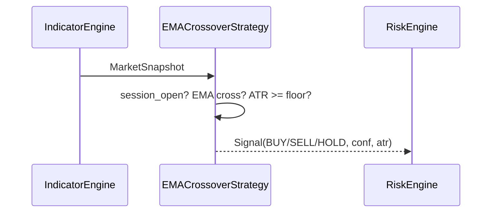

# Phase 05 — Strategies

## Objective

Turn a `MarketSnapshot` into a **trading decision** (`Signal`) using a
strategy-independent interface, so multiple entry rules can coexist and be
swapped by config. Delivers `EMACrossoverStrategy` and a `Signal` contract.

## Architecture

</think>

<｜DSML｜tool_calls>
<｜DSML｜invoke name="write">
<｜DSML｜parameter name="content" string="true"># Phase 05 — Strategies

## Objective

Turn a `MarketSnapshot` into a **trading decision** (a core `Signal`) using an
adapter-friendly strategy interface, so multiple strategies can coexist and be
swapped by config. Delivers the `EMACrossoverStrategy` and a strategy contract.

## Architecture

`IndicatorEngine` → `MarketSnapshot` → `StrategyEngine` → `Signal` → risk gate
(Phase 06). The strategy is a pure function of the snapshot + session; it never
touches timing/battery state from broker specifics, the market, or the DB.

## Responsibilities

- Generate `Signal` with direction, confidence, entry, stop, target, and
  `atr_pips`.
- Avoid signal during inactive session (forex weekend / off-session).
- Run a `1h` confirmation window (via AI enhancer) when enabled.
- Expose a discoverable list of strategies and an `active_strategy` switch.

It must not place orders, manage risks, or persist anything.

## Folder Structure

```
src/strategies/
└── ema_crossover.py      # EMACrossoverStrategy + TradeSignal (alias→ core Signal)
```

## Class Diagram



## Sequence Diagram (signal generation)



## Data Flow

In: `MarketSnapshot` + session. Out: `Signal` (core model). Persisted only by
Phase 10; displayed by the dashboard.

## Configuration

| Setting | Default | Purpose |
|---------|---------|---------|
| `active_strategy` | `EMACrossover` | Which strategy runs |
| `min_atr_pips` | `5.0` | ATR floor (calibrated forex; review for crypto) |
| `confirmation_timeframe` | `1h` | Higher-TF confirmation check |
| `min_confidence` | `0.60` | Signal gate |

## Implementation Steps

1. Strategy base interface with `make_signal(snapshot)`.
2. ATR floor + crossover detection + confidence scoring.
3. Higher-TF confirmation (signals live on 15m, confirm with 1h).

## Testing

- crossover detection, direction, confidence, floor rejects. ✅
- Div-zero / reusability of widely-used EMA windows.
- Backtest uses the same path as live.

## Definition of Done

- [x] `EMACrossoverStrategy` emits correct `Signal`s.
- [x] Suite green; indicator + strategy share code with backtest.

## Future

- Additional strategies (RSI, MACD) surfaced in Strategy Lab.
- Strategy registry with runtime validation.