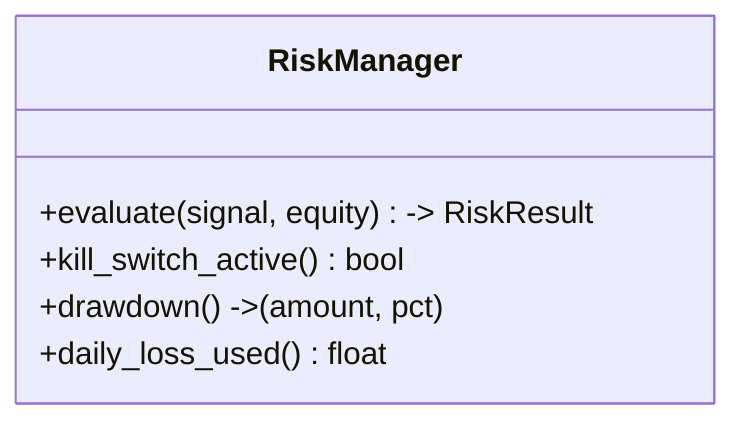

# Phase 06 — Risk Engine

## Objective

Guard the account: evaluate every `Signal` against position/risk and equity, and
stop all trading when a threshold is breached. Delivers the `RiskManager` (10
checks), position sizing, and the persistent kill switch — a central safety gate.

## Architecture

```
signal ──▶ RiskManager.evaluate(signal, equity) ──approved─▶ ExecutionEngine
                  │ rejected → reason recorded (DB), signal stored
                  └ active kill switch halts everything
```

## Responsibilities

- Validate amount at risk per trade (1.5% → ~$30), max open trades, max daily
  loss, drawdown limit.
- Compute position sizing from ATR/pips + capitalization.
- Record `risk_decision` (accepted/rejected) + `risk_reason` per signal.
- Own the **kill switch** flag in `risk_state`.
- Enforce `min_atr_pips` floor as a hard risk filter.

Must not execute; only gate + size + record.

## Folder Structure

```
src/risk/
└── manager.py      # RiskManager + risk_state reads/writes
```

## Class Diagram



## Data Flow

Signal + equity → checks → accept/reject + sized `Trade` inputs → position
manager. Rejects persisted as `signals.risk_decision/risk_reason`.

## Configuration

| Setting | Default | Purpose |
|---------|---------|---------|
| `initial_capital` | 2000 | Base equity |
| `max_risk_per_trade` | 1.5% ($30) | Size |
| `max_daily_loss` | 3% ($60) | Day halt |
| `max_drawdown` | 10% ($200) | Kill switch |
| `max_open_trades` | 2 | Concurrency |

## Implementation Steps

1. Build the risk checks as the `evaluate()` gate.
2. Wire drawdown + daily-loss tracking into `risk_state`.
3. Add the kill-switch check to the orchestrator loop.

## Testing

- acceptance/rejection matrices per check; kill switch; drawdown rollups. ✅

## Definition of Done

- [x] RiskManager gate/sizing works end-to-end paper.
- [x] `risk_state` updated each evaluation; dashboard Risk Center reads it.

## Future

- Correlation / exposure guard (moves to portfolio when multi-broker).
- Per-strategy risk profiles.