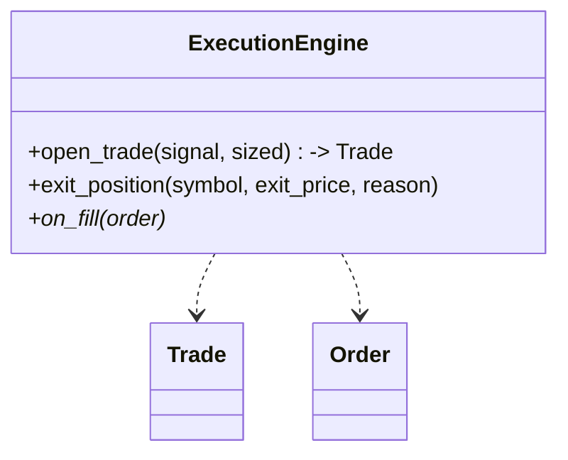
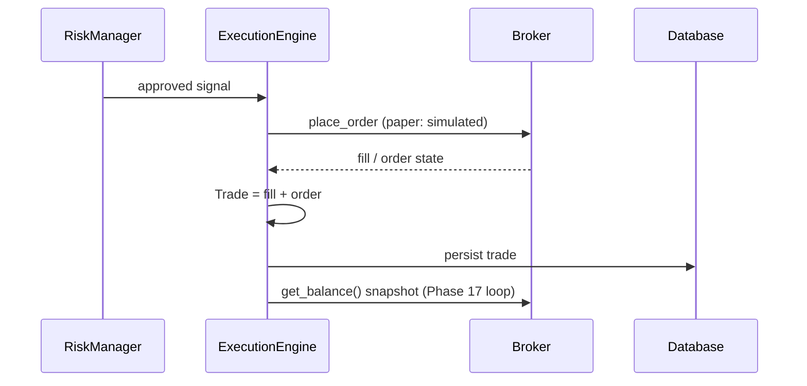

# Phase 07 — Execution

## Objective

Take an approved `Signal` and turn it into a **fill** (paper or live) reliably,
attaching a broker-neutral `Order` and producing a `Trade`. Delivers the
`ExecutionEngine`.

## Architecture

```
RiskManager ──approved──▶ ExecutionEngine ──▶ Broker adapter (place order)
                                │ fills → core.Order
                                └ persists a Trade (Phase 10)
```

## Responsibilities

- Open a position at the current market price (paper: simulated fill).
- Build a filled `Order` per fill and attach it (`Trade.order`).
- Close a return to the position manager via `exit_position`.
- Persist `Trade` rows (exec_id mapping fixed in Phase 07/iteration 2).
- Route paper vs live without changing engine logic.

Must not decide *whether* to trade (that's risk/strategy).

## Folder Structure

```
src/execution/
└── engine.py      # ExecutionEngine (paper/live) + Trade alias→ core.Trade
```

## Class Diagram



## Sequence Diagram (paper open)



## Configuration

| Setting | Default | Purpose |
|---------|---------|---------|
| `TRADING_MODE` | `paper` | `paper` / `live` |
| slippage model | backtest only | Fill realism |

## Testing

- Paper fill lifecycle, re-entry guard, exit reasons, exec_id mapping. ✅
- E2E orchestrator open→pips→close tests (poll-for-fill).

## Definition of Done

- [x] Every fill emits a filled core `Order` attached to `Trade.order`.
- [x] Paper path runs full pipeline 0 errors on Binance.

## Future

- Live order status surface from broker (`OrderStatus`).
- Order manager split (target `execution/order_manager`).