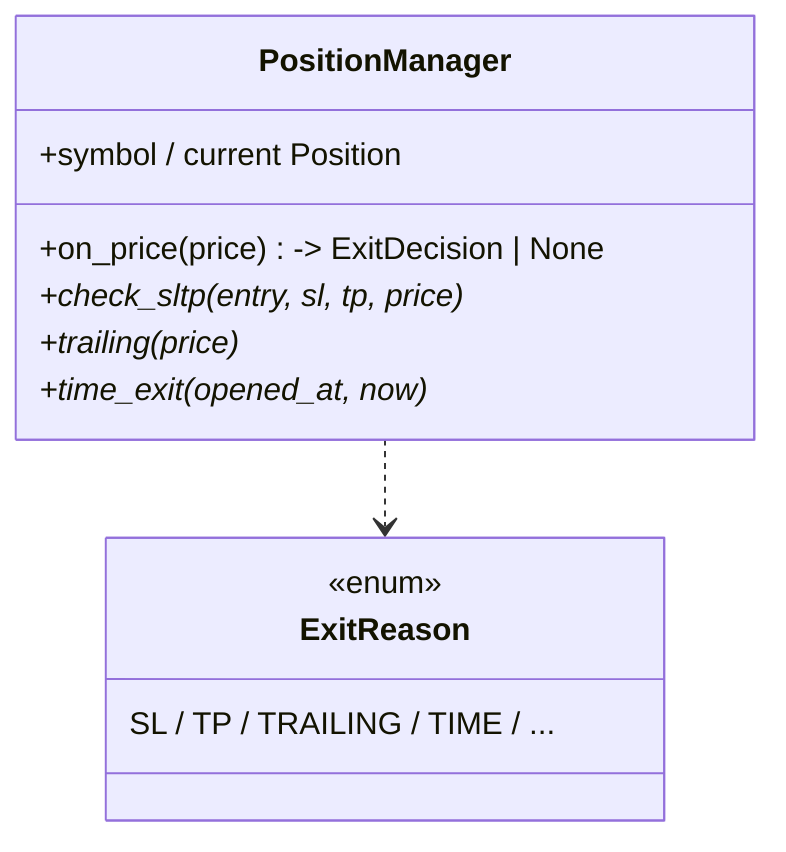
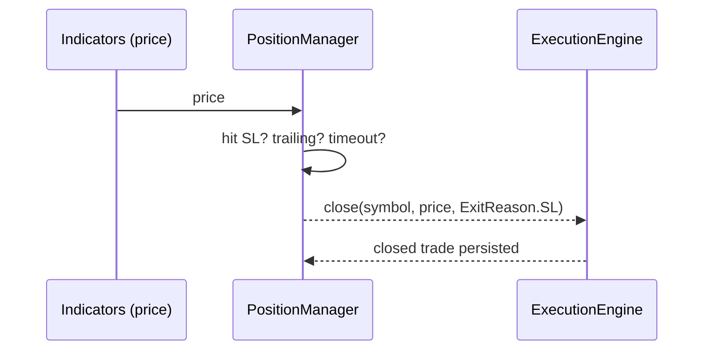

# Phase 08 — Position Manager

## Objective

Manage open positions to a profitable/limited exit: stop-loss, take-profit,
trailing, and time-based exit. Delivers the `PositionManager` state machine
which reads the core `Position`/`Trade` models.

## Architecture

Execution opens a `Trade` → `PositionManager` monitors price → decides the exit
status → asks execution to close → records `ExitReason`.

## Responsibilities

- Enforce SL/TP levels (persisted at entry).
- Optional trailing stop once in profit by a configurable fraction.
- Time-based exit (max holding duration).
- Convert an exit signal into a close with an `ExitReason` enum.
- Never open trades (execution owns opening).

## Folder Structure

```
src/position_manager/
└── manager.py      # PositionManager + Position/Trade alias→ core
```

## Class Diagram



## Sequence Diagram (SL hit)



## Data Flow

In: open `Trade` + live price. Out: `ExitReason` → execution close → DB state.

## Testing

- SL/TP firing, trailing lock, time exit, div-zero on parity. ✅
- `ExitReason` mapping in `save_trade` (Iteration 18 fixed exec_id map).

## Definition of Done

- [x] Every exit path persists a correct `ExitReason`.
- [x] Suite green; paper run closes positions on all exit rules.

## Future

- Breakeven/step controls, partial closes, basket/hedge-aware exits.