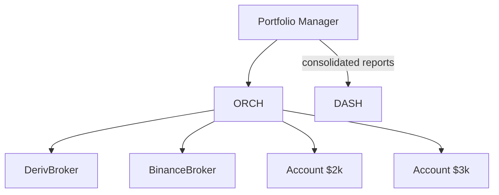

# Phase 09 — Portfolio

**Status: future (multi-broker).** Not built yet. This document is the contract
that gates building the layer.

## Objective

Aggregate multiple broker accounts, allocate capital, and enforce **global**
risk limits across them. Until multi-broker is active, the `RiskManager` enforces
per-account limits and the portfolio layer is a thin wrapper.

## Responsibilities (target)

- Capital allocation between brokers.
- Total account value / equity aggregation.
- Global risk limits (max daily loss, drawdown, exposure) across accounts.
- Correlation guard — avoid double-exposure to the same underlying.
- Consolidated performance reporting.

## Architecture



## Folder Structure (target)

```
src/portfolio/
├── manager.py      # PortfolioManager
├── allocation.py   # capital distribution
└── exposure.py     # global limits
```

## Status

- 🟡 **planned / future.** Build entry gate: a second live broker or a second
  account exists. `01_System_Architecture.md` (Portfolio layer) is the spec.

## Definition of Done (when built)

- [ ] Multi-broker running simultaneously.
- [ ] Total equity aggregation + consolidated equity curve.
- [ ] Global drawdown/daily-loss kill switch.
- [ ] Dashboard Portfolio page reads multiple sources.