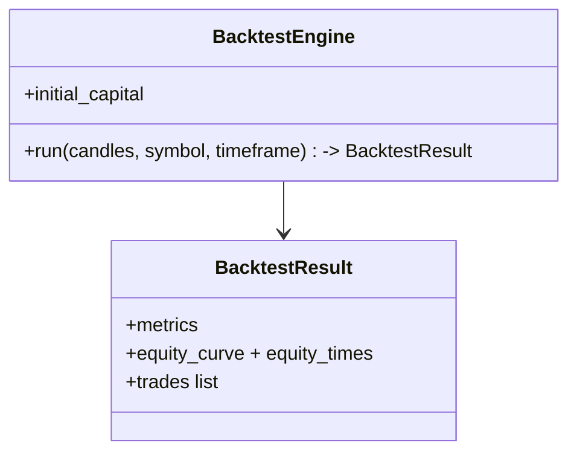

# Phase 11 — Backtesting

## Objective

Replay historical candles through the **same** indicator/strategy/risk
execution path as live trading and report performance — so optimizations (Phase
12) and manual validation use identical logic.

## Responsibilities

`BacktestEngine` runs OHLCV candles through the real EMACrossover + RiskManager,
applies slippage, and produces a `BacktestResult`:

- net P&L, total trades, win rate, profit factor, max drawdown %, Sharpe.
- equity curve + times, per-trade list (entry/exit/pnl/exit_reason).
- Deterministic and fast (`O(n)`).

It **reuses live code** instead of re-implementing strategy/risk in parallel.

## Folder Structure

```
src/backtesting/
└── engine.py      # BacktestEngine + BacktestResult + Trade slots
```

## Class Diagram



## Data Flow

DB/CSV candles → window browsing → EMACrossover → RiskManager → fills with
slippage → equity → `BacktestEngine` → metrics. GUI: **Backtesting page** in the
dashboard runs this engine live on DB candles.

## Config

| Setting | Default | Purpose |
|---------|---------|---------|
| `initial_capital` | 2000 | Equity base |
| slippage model | set | fill realism |

## Testing

- Deterministic results on a fixed series; equity monotonic light.
- Same-strategy parity: backtest vs live share code path. ✅

## Definition of Done

- [x] `BacktestResult` fields contract consumed by dashboard + optimization.
- [x] CLI and dashboard Backtest page run it.

## Future

- Walk-forward, walk-over/pair economic months, parameter sweeps w/ warmup.