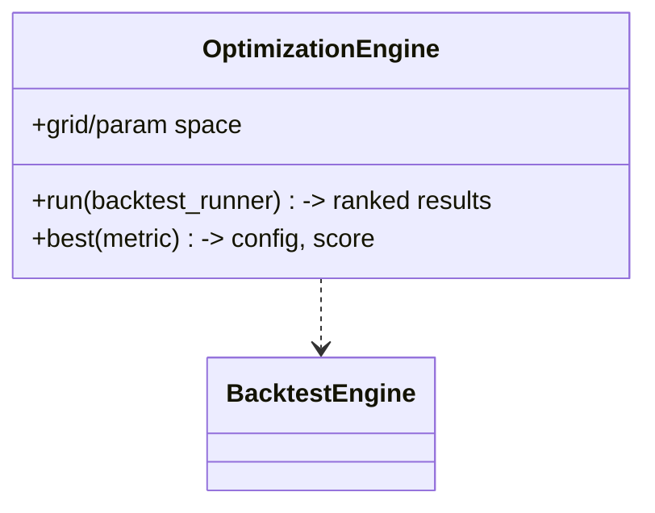

# Phase 12 — Optimization

## Objective

Automate strategy-parameter search over a target metric (net P&L, Sharpe, PF,
drawdown) using the deterministic `BacktestEngine`, so param choices are backed
by data rather than intuition.

## Responsibilities

- Sweep a parameter grid (EMA periods, ATR floor, confidence, etc.).
- Score each configuration by a chosen objective/metric.
- Report the best config, avoid look-ahead (comparison on validation windows).
- Expose results for CLI + optional dashboard surfacing.

It must not trade live; it is a research tool.

## Folder Structure

```
src/optimization/
└── engine.py      # OptimizationEngine (grid search)
```

## Class Diagram



## Data Flow

Param grid × candles → repeated `BacktestEngine.run` → ranked table → pick best
+ persist/display. A "⚡ Strategy Lab" dashboard surfaces per-strategy stats.

## Testing

- Equivalent to N backtests; grid bounds; best-config selection. ✅

## Definition of Done

- [x] `O(n)` speedup + param sweep (Iteration 1).
- [x] CLI runs sweeps; EMA param tuning recorded.

## Future

- Walk-forward resampling, early generic evaluator, genetic/no-gradient search.