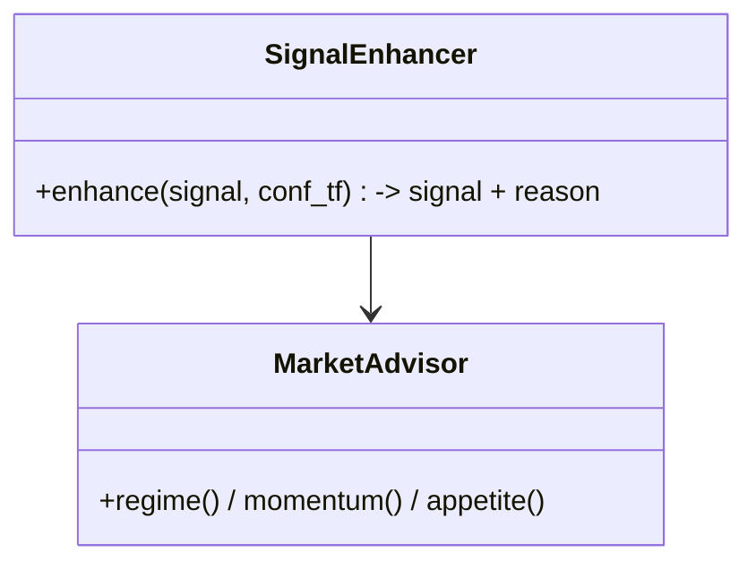

# Phase 16 — AI Research Lab

## Objective

Add an advisory intelligence layer that enriches signals with **research-grade
notes** — multi-timeframe confirmation, regime/momentum context, and an explainable
"AI research note" — without making the final trading decision (risk does).

## Responsibilities

`ai_lab` reads market/snapshot data and produces annotations on signals:

- Regime / momentum / market-appetite read (`MarketAdvisor`).
- 1h confirmation + confidence boost (`SignalEnhancer`).
- Free-text research note prefixed `AI:` stored on the signal.
- Zero control over fills; advisory only.

## Folder Structure

```
src/ai_lab/
├── advisor.py          # MarketAdvisor (regime / momentum / appetite)
└── signal_enhancer.py  # SignalEnhancer (multi-TF conf + AI note)
```

## Data Flow

Candles/indicators → AI lab → enriched `Signal` (higher confidence + reason) →
risk. The "AI research" note is shown as an expander on the dashboard Signals
page (Iterations 3 & 4).

## Class Diagram



## Config

| Setting | Default | Purpose |
|---------|---------|---------|
| `confirmation_timeframe` | `1h` | Higher-TF read |
| `min_confidence` | `0.60` | Post-enhancement gate |

## Testing

- `SignalEnhancer` multi-TF confirmation + stored 1h confirmation; 13 tests. ✅
- AI notes surfaced + reasons prefixed `AI:` in the dashboard Signals page.

## Definition of Done

- [x] AI notes shown; reasons `AI:` prefixed.
- [x] AI never overrides risk decisions (human-risk gate stayed).

## Future

- AI Research page (regime history).
- Model-backed confidence calibration.