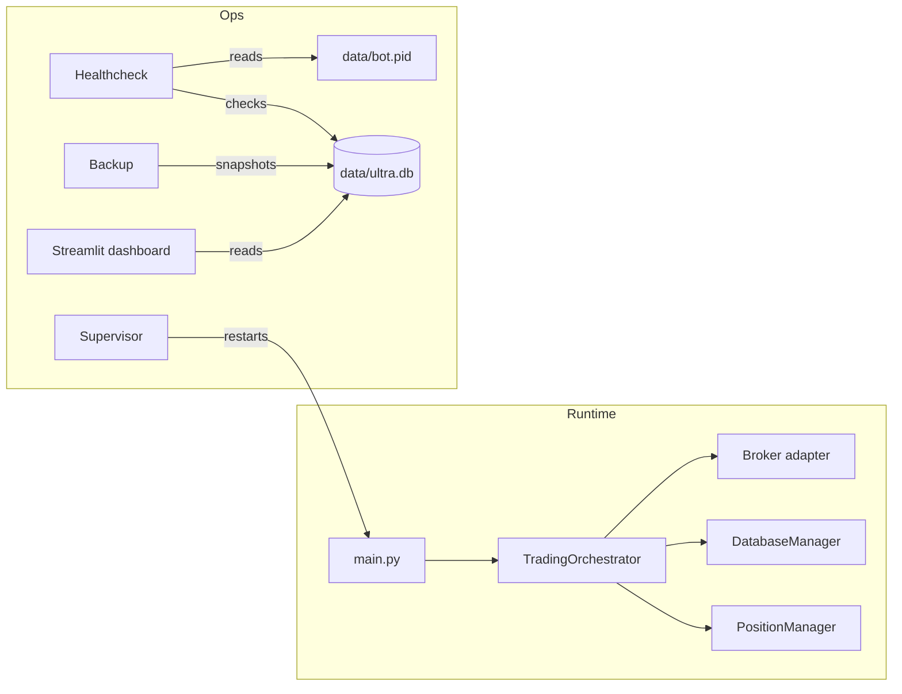
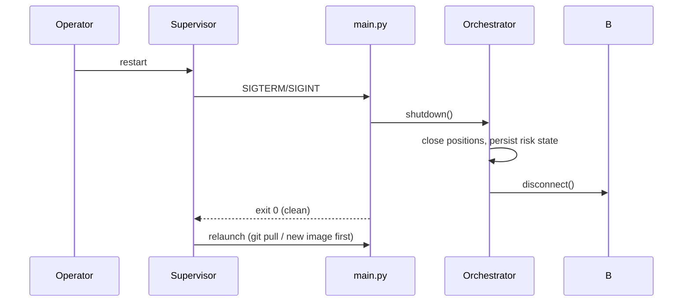

# Phase 17 — Deployment & Operations

## Objective

Ship ULTRA as a runnable, observable, self-healing service on a Linux VPS
(recommended), Windows, or a container runtime, with backups and upgrades that
are safe to do unattended. "Deployed" means: the bot starts on boot, restarts
after crashes, is monitored, and can be upgraded without data loss.

## Architecture

See `01_System_Architecture.md` for the layered design. This phase wraps the
whole platform in an operational shell:

```
market data (Binance/Deriv) → orchestrator → DB (data/) + logs (logs/)
        ↑                          |              ↓
   healthcheck ← data/bot.pid + DB freshness     dashboard (8501)
        ↑                          |
   supervisor (systemd / Docker / start.sh / start.ps1)  ← auto-restart
```

## Responsibilities

The deployment layer must:
- Restart the bot on crash, with bounded backoff (avoid crash loops).
- Stop gracefully on `SIGINT`/`SIGTERM` (close positions, persist state).
- Persist state (DB, logs, backups) outside ephemeral storage.
- Expose a health probe (process alive + DB recently written).
- Keep secrets in environment/config, never in the image or repo.

It must not:
- Bake tokens or keys into images, units, or source.
- Run as root (use an unprivileged user / container user).

## Folder Structure

```
deploy/
  ultra.service     # systemd unit (Linux)
  start.sh          # bash supervisor (Linux/macOS)
  start.ps1         # PowerShell supervisor (Windows)
  healthcheck.ps1   # health probe (Windows; pattern portable to Linux)
  backup.ps1        # DB + log backup with pruning (Windows)
Dockerfile          # container image (python:3.12-slim, non-root)
docker-compose.yml  # volumes, env_file, restart policy, log rotation
.dockerignore
VERSION             # version file (single source of truth)
requirements.txt    # runtime deps
requirements-dev.txt# runtime + test deps
.github/workflows/ci.yml  # CI: full suite on push/PR
DEPLOYMENT.md       # operator runbook (this phase, ops-focused)
```

## Class / Component Diagram



## Sequence Diagram (stop → upgrade → start)



## Data Flow

- Runtime state: `data/ultra.db` (SQLite) + `logs/*.log` — mounted volumes in
  Docker, real dirs under the install path otherwise.
- Health: `main.py` writes `data/bot.pid`; healthchecks probe process + DB
  `LastWriteTime`.
- Backups: copy DB (WAL-safe) + logs → dated zip → prune older than N days.

## Configuration

| Setting | Default | Notes |
|---------|---------|-------|
| `BROKER` | `binance` (compose) / `deriv` | `deriv` or `binance` |
| `TRADING_MODE` | `paper` | `paper` / `live` / `backtest` |
| `DERIV_API_TOKEN` | (none) | required only for `live` |
| `LOG_LEVEL` | `INFO` | `DEBUG|INFO|WARNING|ERROR` |
| `DASHBOARD_PORT` | `8501` | compose host port for Streamlit |
| `ALERT_EMAIL` / `WEBHOOK_URL` | (none) | monitoring notifications |

## Implementation Steps

1. [x] Runtime deps separated from dev deps (`requirements.txt` /
   `requirements-dev.txt`).
2. [x] Supervisor + graceful shutdown (systemd `KillSignal=SIGINT`,
   `start.sh`, `start.ps1`).
3. [x] Health probe (`deploy/healthcheck.ps1`; `data/bot.pid`).
4. [x] Backup with retention (`deploy/backup.ps1`).
5. [x] `Dockerfile` + `docker-compose.yml` (non-root, volumes, log rotation).
6. [x] `VERSION` file + `src/utils/version.py`; startup logs the version.
7. [x] CI workflow (`.github/workflows/ci.yml`) runs the full suite.
8. [x] Operator runbook (`DEPLOYMENT.md`) + phase spec (this doc).

## Testing

- Unit/integration: full pytest suite (see BLUEPRINT_CHECKLIST.md for counts).
- Loop: `python scripts/iterate.py --full` (criteria C1–C8 + tests).
- Ops smoke: start bot → confirm `data/bot.pid` + heartbeats → SIGTERM → clean
  exit → healthcheck passes → backup creates a zip → container restarts on
  crash (`docker compose restart` / kill + observe restart).

## Definition of Done

- [x] `python main.py --mode paper` runs and writes DB/logs/pid.
- [x] Crash → auto-restart (supervisor or Docker restart policy).
- [x] `SIGINT`/`SIGTERM` → graceful shutdown (positions closed, state saved).
- [x] Healthcheck returns non-zero on failure; zero when healthy.
- [x] Backups created and pruned.
- [x] Image is non-root and contains no secrets.
- [x] CI green; loop criteria green.

## Future Improvements

- Postgres backend for analytics (config exists, not wired).
- Prometheus/health HTTP endpoint + Grafana.
- Multi-account / multi-broker deployment (portfolio phase).
- Container image pinned patch versions (currently `>=` ranges in requirements).
